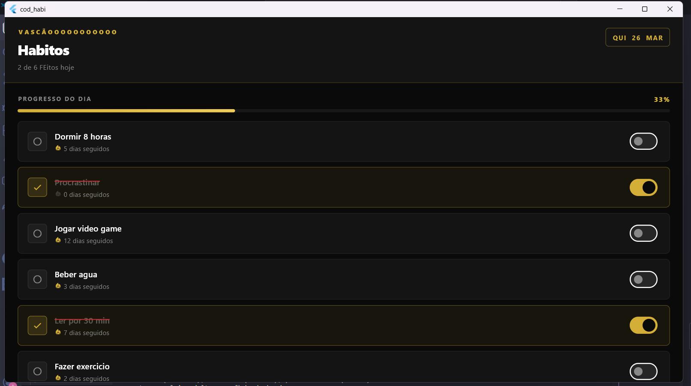
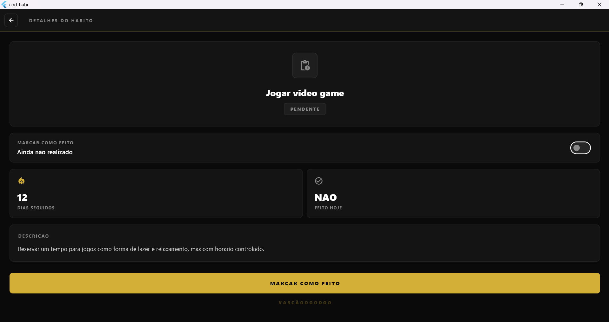
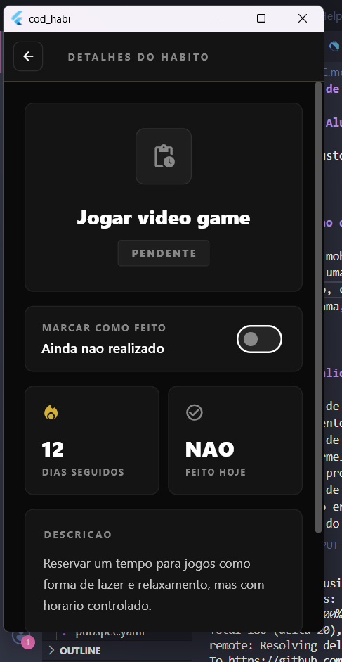

# Controle de Habitos - Vasco da Gama

## Nome do Aluno

Otavio Augusto

---

## Screenshots

<p align="center">
  
  
  
</p>

---

## Descricao do Aplicativo

Aplicativo mobile desenvolvido em Flutter para controle de habitos pessoais diarios. O app permite ao usuario visualizar uma lista de habitos, marcar cada um como concluido ou pendente e acompanhar informacoes detalhadas de cada habito, como descricao e sequencia de dias consecutivos realizados. O design segue a identidade visual do Vasco da Gama, com as cores preto, branco e dourado.

---

## Funcionalidades Implementadas

- Exibicao de lista de habitos cadastrados com nome e status
- Carregamento inicial simulado com `async/await` e `Future.delayed`
- Marcacao de habitos como concluidos via `Switch`
- Risco vermelho sobre o nome do habito quando concluido
- Barra de progresso diaria com percentual de conclusao
- Contador de dias seguidos por habito
- Navegacao entre duas telas com `Navigator.push`
- Passagem do objeto `Habito` da tela de lista para a tela de detalhes
- Callback `onToggle` para sincronizar o estado entre as telas
- Tela de detalhes com descricao, estatisticas e botao de alternar status
- Gerenciamento de estado com `StatefulWidget` e `setState`
- Design temático com cores do Vasco da Gama (preto, branco e dourado)

---

## Estrutura do Projeto

```
lib/
├── main.dart
├── models/
│   └── habito.dart
└── screens/
    ├── home_screen.dart
    └── habit_details_screen.dart
```

---

## Instrucoes para Execucao do Projeto

### Pre-requisitos

- Flutter SDK instalado (versao 3.0.0 ou superior)
- Dart SDK incluido com o Flutter
- Android Studio ou VS Code com a extensao Flutter
- Um dispositivo fisico conectado ou emulador Android/iOS configurado

### Passos para executar

1. Clone ou baixe o projeto para sua maquina

2. Acesse a pasta do projeto pelo terminal:
   ```bash
   cd habitos_app
   ```

3. Instale as dependencias:
   ```bash
   flutter pub get
   ```

4. Verifique se ha um dispositivo disponivel:
   ```bash
   flutter devices
   ```

5. Execute o aplicativo:
   ```bash
   flutter run
   ```

### Executar em plataforma especifica

```bash
flutter run -d android
flutter run -d ios
flutter run -d chrome
```